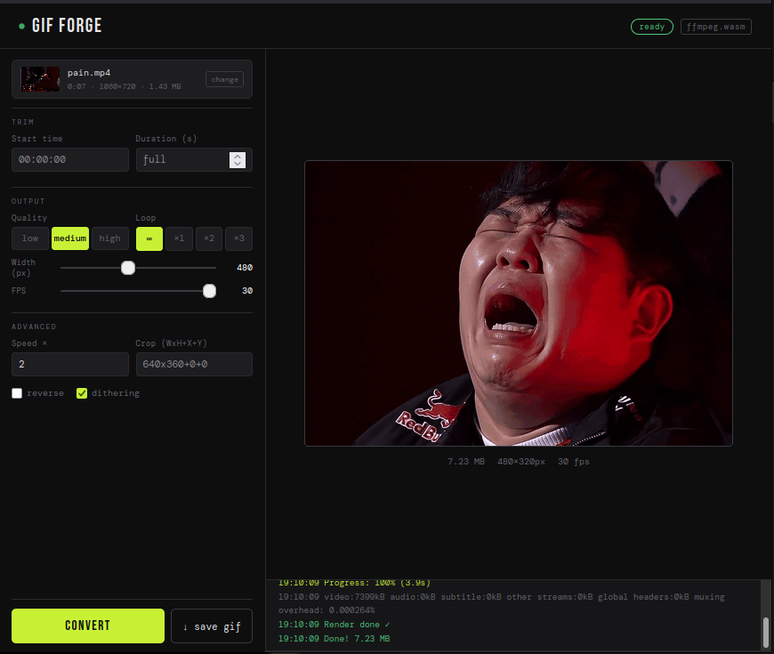

# GIF Forge



GIF Forge is a lightweight, client-side web application designed for fast, browser-based video-to-GIF conversion using `ffmpeg.wasm`. By leveraging WebAssembly, it allows users to perform media processing locally without needing to upload videos to a server.

## How It Works

1. **Upload:** Select a video file from your local machine.
2. **Process:** Once loaded, the app uses `ffmpeg.wasm` to transcode the video stream. You can customize conversion parameters such as frame rate and resolution.
3. **Download:** Once the processing is complete, the generated GIF is made available for download directly from your browser's cache.

## Key Features

- **Local Processing:** Convert videos to GIFs entirely within your browser using WebAssembly. No data is sent to external servers.
- **Privacy-First:** Your video files never leave your computer, ensuring complete data sovereignty and privacy.
- **High Performance:** Leverages multi-threaded WebAssembly to achieve fast transcoding speeds comparable to native desktop applications.
- **Customizable Output:** Tailor your GIFs with adjustable settings:
    - **Resolution:** Scale the output dimensions to fit your needs.
    - **Frame Rate (FPS):** Balance between quality and file size.
    - **Duration:** Trim specific sections of your video.
- **Flexible Integration:** Ships with both ESM and UMD versions of the `ffmpeg.wasm` binaries to support various frontend project structures.

## Tech Stack

- **Core:** Vanilla HTML5, CSS, and JavaScript.
- **Processing Engine:** `ffmpeg.wasm` (WebAssembly port of FFmpeg).
- **Development Server:** Node.js (custom implementation for cross-origin security headers).
- **Binaries:** Compiled `ffmpeg.wasm` provided in both ESM and UMD formats.

## Prerequisites

- **Node.js:** v16.0 or higher (required to run the development server).
- **Modern Browser:** A browser supporting `SharedArrayBuffer` (e.g., Chrome, Edge, Firefox).

## Getting Started

### 1. Clone/Download the Project

If you haven't already, ensure you have the files in your local directory.

### 2. Start the Development Server

The application requires specific security headers (`COOP` and `COEP`) to enable `SharedArrayBuffer` for the FFmpeg WASM module. Use the provided Node.js server:

```bash
node server.mjs
```

### 3. Access the Application

Once the server is running, open your browser and navigate to:
`http://localhost:8080`

## Architecture

### Directory Structure

```text
├── lib/
│   ├── core/
│   │   ├── ffmpeg-core.js
│   │   └── ffmpeg-core.wasm
│   ├── ffmpeg-all.js
│   ├── worker.js
├── compiled_ffpmeg_wasm_esm-umd.tar.xz
├── index.html
├── server.mjs
├── screenshot.png
└── README.md
```

### Request Lifecycle

1. The browser requests `index.html` from `server.mjs`.
2. `server.mjs` serves files with mandatory security headers:
   - `Cross-Origin-Opener-Policy: same-origin`
   - `Cross-Origin-Embedder-Policy: require-corp`
3. The client loads `ffmpeg.wasm` assets from `/lib/core/`.
4. Video files are processed locally in the browser's memory using WebAssembly.

## Environment Variables

The server defaults to port `8080`. You can specify a custom port by passing it as an argument:

```bash
node server.mjs 3000
```

## Available Scripts

| Command | Description |
| :--- | :--- |
| `node server.mjs` | Starts the GIF Forge local development server |

## Troubleshooting

### FFmpeg fails to initialize
If the console displays an error related to `SharedArrayBuffer` or headers, ensure the server is running and your browser is not blocking the security headers.

### High initial load time
The first time you load the application, the browser must download the `ffmpeg-core.wasm` binary (~36MB). This is normal; subsequent loads should be faster if cached.
